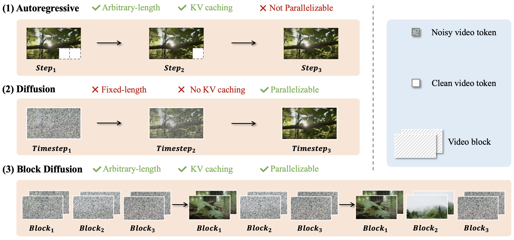
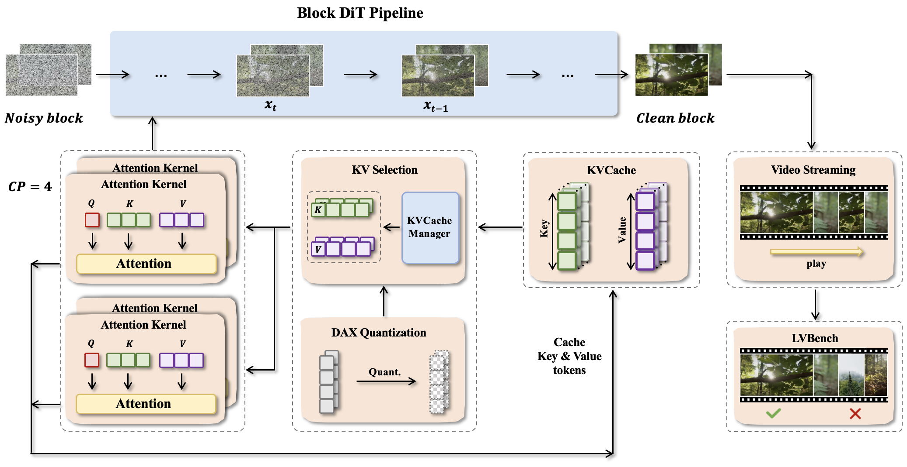

# Inferix
<!--
[](blog) | [](github) | 
-->
[](https://arxiv.org/abs/2511.20714) | [](https://huggingface.co/papers/2511.20714) | [](https://ziplab.co/BlockVid/assets/BlockVid_DAMO.pdf) | [](https://ziplab.co/BlockVid/)


## 📢 News

- **[2025.11]** [Technical report](https://arxiv.org/abs/2511.20714) is available!
- **[2025.10]** Inferix is released!

## 🚀 About

World models serve as core simulators for fields such as agentic AI, embodied AI, and gaming, capable of generating long, physically realistic, and interactive high-quality videos. Moreover, scaling these models could unlock emergent capabilities in visual perception, understanding, and reasoning, paving the way for a new paradigm that moves beyond current LLM-centric vision foundation models. A key breakthrough empowering them is the **semi-autoregressive (block-diffusion)** decoding paradigm, which merges the strengths of diffusion and autoregressive methods by generating video tokens in blocks—applying diffusion within each block while conditioning on previous ones, resulting in more coherent and stable video sequences.

Crucially, it overcomes limitations of standard video diffusion by reintroducing LLM-style KV Cache management, enabling efficient, variable-length, and high-quality generation.

Therefore, **Inferix** is specifically designed as a next-generation inference engine to enable immersive world synthesis through optimized semi-autoregressive decoding processes. This dedicated focus on world simulation distinctly sets it apart from systems engineered for high-concurrency scenarios (like [vLLM](https://github.com/vllm-project/vllm) or [SGLang](https://github.com/sgl-project/sglang)) and from classic video diffusion models (such as [xDiTs](https://github.com/xdit-project/xDiT)).

<p align="center">
    
</p>

## ✨ Key Features

- 🧠 **Advanced KV Cache Management**: Intelligent memory management for persistent world simulation
- 🔀 **Distributed World Synthesis**: Support for large-scale immersive environment generation
- 📹 **Video Streaming**: Basic video streaming capabilities for generated content, with both RTMP and WebRTC supported as streaming protocols.
- 🔧 **Seamless Model Integration**: Simple API for world model deployment
- 📊 **Next-Gen Architecture**: Built for immersive world synthesis at scale
- 📈 **Built-in Profiling**: Performance monitoring and analysis capabilities with enhanced diffusion model profiling
- 🔄 **Continuous Prompt Support**: Enable dynamic narrative control with different prompts for different video segments (see [CausVid example](example/causvid/))
- 🚀 **Quantized Inference**: 8-bit(INT8 / FP8) quantization(Per-tensor / Per-token-per-channel) with [DAX](https://github.com/RiseAI-Sys/DAX) support

<p align="center">
    
</p>

## 🗓️ Roadmap

### Framework Enhancements
- [ ] Complex KV Management
- [ ] Support finetuning a pretrained video gen model (Diffusion to Semi-AR) & distill models into few steps.
- [ ] Support high-concurrency deployment
- [ ] Support more complex distributed inference
- [ ] Improve video streaming usage and performance
- [ ] Advanced real-time streaming capabilities

### World Model Support
- [ ] Interactive World Models
- [ ] Enhanced Simulation Capabilities
- [ ] Persistent World State Management

## 🚀 Getting Started

### Installation

See [Installation Guide](Installation.md) for detailed instructions.

### Run Examples

Check out our [example configurations](example/) for different models:

### Supported Semi-autoregressive Models

- **Self Forcing**: [Configuration](example/self_forcing/README.md)
- **CausVid**: [Configuration](example/causvid/README.md)
- **MAGI-1**: [Configuration](example/magi/README.md)

## 🔧 Model Integration Guide

View our [Model Integration Guide](model_integration_guide.md) for detailed instructions. Below is a simple guide:

To integrate your own semi-autoregressive models with Inferix, follow these steps:

### 1. Create Model Directory Structure

```
inferix/
└── models/
    └── your_model_name/
        ├── __init__.py
        ├── model.py              # Model architecture implementation
        ├── config.py             # Model-specific configuration handling
        └── utils.py              # Utility functions for your model (optional)
```

#### 1.1 Using Wan-Base model
Since Wan-1.3B is widely used as bisic pretrained diffusion model in the world model community, we provide it as a base model.
You can extend it in the [models/wan_base](https://github.com/inferix/inferix/models/wan_base) directory, just like Self Forcing and CausVid.
If you need other base models, please let us know and we will provide them as soon as possible.

### 2. Implement Pipeline Class

Create a pipeline class that inherits from [AbstractInferencePipeline](inferix/pipeline/base_pipeline.py).

Key methods to implement:
- `load_checkpoint()`: Load model weights
- `run_text_to_video()`: Text-to-video generation
- `run_image_to_video()`: Image-to-video generation
- `_initialize_pipeline()`: Custom initialization logic

### 3. Create Example

Add example in the [example/your_model_name/](example/) directory:
- README.md with usage instructions
- run_your_model.py for execution
- shell script for execution

#### 3.1. Add Configuration Files at Example Directory

Create YAML or JSON configuration files for your model in the [example/your_model_name/configs/](example/your_model_name/configs/) directory.

### 4. Update Documentation

Add your model to the main README and create detailed documentation in your model's example directory.

## Benchmarks

### LVBench
[](benchmark)

LV-Bench is a curated benchmark of 1,000 minute-long videos targeted at evaluating long-horizon generation. Please refer to [LV-Bench](LV-Bench/README.md) for more details.

## 📝 License

This project is licensed under the [Apache License 2.0](LICENSE).

The main code of Inferix is based on the Apache 2.0 license. However, some included third-party components may be subject to their respective open-source licenses. Users should comply with the corresponding licenses of these third-party components when using them.

## 📞 Contact Us

For questions and support, please reach out through:
- GitHub Issues
- Email: tangjiashengkaka@gmail.com

## 📚 Citation

If you use Inferix in your research, please cite:

```bibtex
@article{inferix2025,
  title={Inferix: A Block-Diffusion Based Next-Generation Inference Engine for World Simulation},
  author={Feng, Tianyu and Han, Yizeng and He, Jiahao and He, Yuanyu and Lin, Xi and Liu, Teng and Lu, Hanfeng and Tang, Jiasheng and Wang, Wei and Wang, Zhiyuan and Wu, Jichao and Yang, Mingyang and Yu, Yinghao and Zhang, Zeyu and Zhuang, Bohan},
  journal={arXiv preprint arXiv:2511.20714},
  year={2025},
  url={https://arxiv.org/abs/2511.20714}
}
```

## 🙏 Acknowledgments

We thank the following projects for their contributions:
- [MAGI](https://github.com/magi-project/magi)
- [xDiT](https://github.com/xdit-project/xDiT)
- [Vbench](https://github.com/vbenchen/vbenchen.github.io)

## Team Members:

We are a joint team from ZJU & HKUST & Alibaba DAMO Academy & Alibaba TRE.

### Current Members:
- Tianyu Feng
- Yizeng Han
- Jiahao He
- Yuanyu He
- Xi Lin
- Teng Liu
- Hanfeng Lu
- Jiasheng Tang
- Wei Wang
- Zhiyuan Wang
- Jichao Wu
- Mingyang Yang
- Yinghao Yu
- Zeyu Zhang
- Bohan Zhuang
